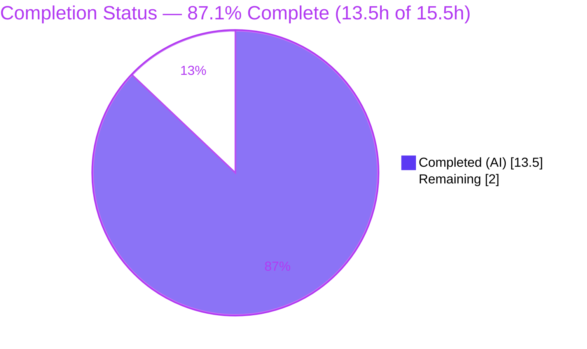
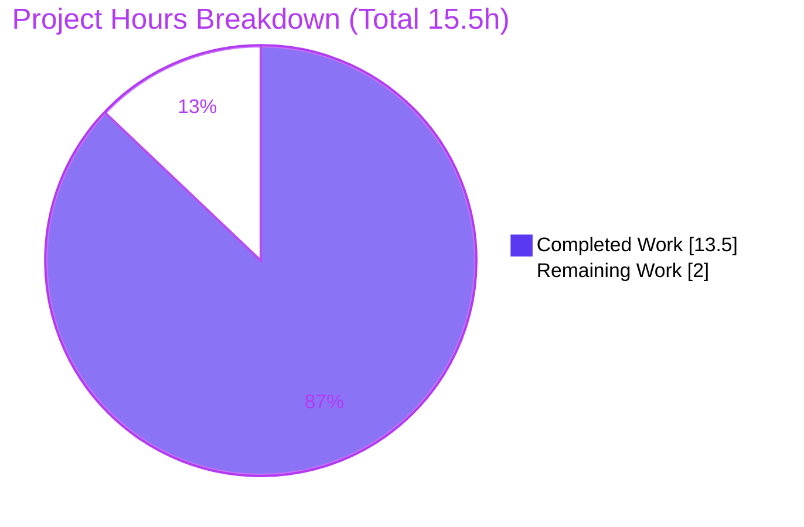
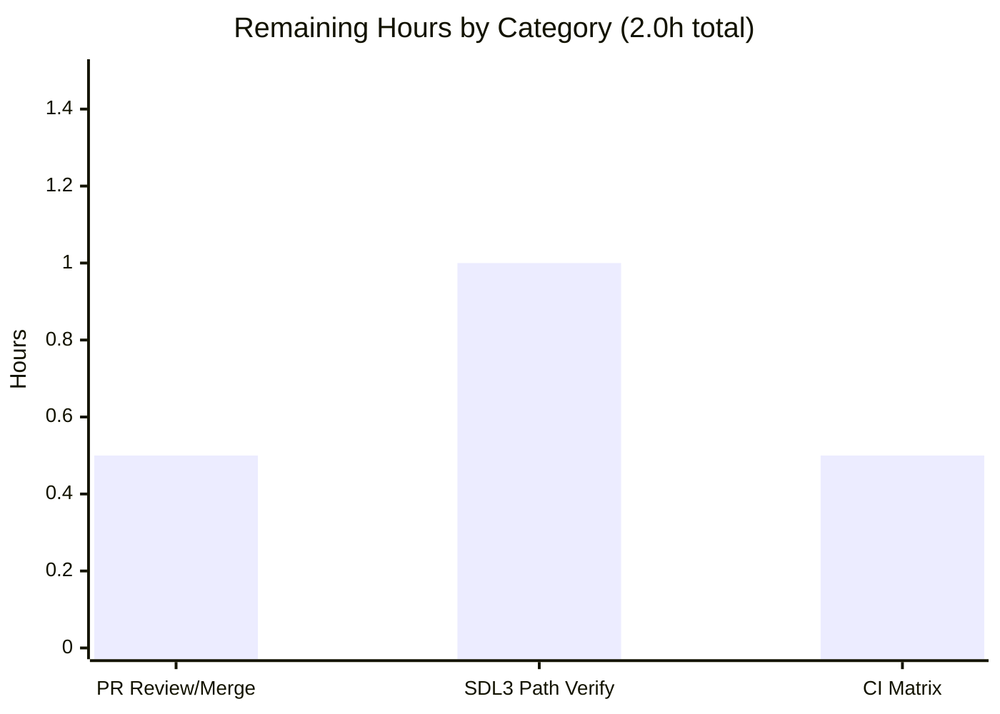

# Blitzy Project Guide — Cataclysm: Dark Days Ahead (SDL2 Tiles Build Fix)

> **Brand legend** — <span style="color:#5B39F3">**Completed / AI Work = Dark Blue `#5B39F3`**</span> · **Remaining / Not Completed = White `#FFFFFF`** · Headings/Accents = Violet-Black `#B23AF2` · Highlight = Mint `#A8FDD9`

---

## 1. Executive Summary

### 1.1 Project Overview

Cataclysm: Dark Days Ahead (CDDA) is a large open-source **C++17** survival roguelike. This engagement resolved a single **build-breaking compilation failure** in the graphical *tiles* client: `src/pixel_minimap.cpp` invoked the **SDL3-only** helper `get_shared_variant_pass()` at two `scoped_render_target` constructions without the SDL-version guard that gates the symbol's declaration. Under the **SDL2 fallback** (`SDL3=0`) the identifier was undeclared, failing `obj/tiles/pixel_minimap.o` and cascading to block `cataclysm.a`, `cataclysm-tiles`, and the entire test binary. Target users are players and packagers building the SDL2 tiles client on hosts lacking SDL3 ≥ 3.4.0. The fix restores the full SDL2 tiles deliverable with **zero regression** to the default SDL3 path.

### 1.2 Completion Status



| Metric | Value |
|---|---|
| **Total Hours** | **15.5** |
| **Completed Hours (AI + Manual)** | **13.5**  (AI: 13.5 · Manual: 0.0) |
| **Remaining Hours** | **2.0** |
| **Percent Complete** | **87.1%**  = 13.5 ÷ 15.5 × 100 |

### 1.3 Key Accomplishments

- ✅ Root cause isolated to a **single missing preprocessor guard** among 446 source files (10,251 tracked files total).
- ✅ Two-site fix applied — `chunk_scope` (L285) and `main_scope` (L477) — **byte-exact to AAP §0.4.1**, mirroring the canonical `src/cata_tiles.cpp` idiom.
- ✅ SDL2 tiles build compiles **warning-clean** under `-Werror -Wall -Wextra` (+ `-Wold-style-cast -Wpedantic -Wsuggest-override -Wzero-as-null-pointer-constant`); the two *"not declared in this scope"* errors are eliminated.
- ✅ Full dependency chain restored: `cataclysm.a` archived → `cataclysm-tiles` linked → `tests/cata_test` built.
- ✅ Full Catch2 regression suite green: **1,891 test cases / 40,498,142 assertions**, exit 0.
- ✅ Runtime validated: `--version` reports `+tiles, +sound` and stamps `a7171eb343`; `--jsonverify` exits 0 (re-verified live this session).
- ✅ Scope discipline maintained: exactly **1 file changed** (`+10 / -4`); all 6 explicitly-excluded files untouched; `astyle` clean; committed as `a7171eb343`.

### 1.4 Critical Unresolved Issues

| Issue | Impact | Owner | ETA |
|---|---|---|---|
| *None* — the SDL2 tiles deliverable is validated end-to-end (build + full test suite + runtime) in the target configuration | No release blockers | — | — |

> There are **no critical unresolved issues**. All items in §1.6 are standard path-to-production gates, not defects.

### 1.5 Access Issues

| System / Resource | Type of Access | Issue Description | Resolution Status | Owner |
|---|---|---|---|---|
| — | — | **No access issues identified** — repository, toolchain, and SDL2 dependency stack are all accessible; the fix is committed on branch `blitzy-9967ef64-e06f-47ac-af02-ab7e782d630f`. | N/A | — |

> **Note (not an access/permissions issue):** This build environment ships no SDL3 ≥ 3.4.0 (`pkg-config --modversion sdl3` → absent; Ubuntu 25.10 provides only 3.2.20, below the Makefile floor). This is a *toolchain-availability constraint*, tracked as Risk **T1** and task **HT-2**, not an access-permission problem.

### 1.6 Recommended Next Steps

1. **[High]** Review and merge the fix commit `a7171eb343` to `master` (diff is `+10/-4` in one file). — *0.5h*
2. **[Medium]** On a host with **SDL3 ≥ 3.4.0**, rebuild the default tiles path and smoke-test to empirically confirm the zero-regression claim. — *1.0h*
3. **[Low]** Confirm CI is green across the full build matrix (curses + SDL2 + SDL3). — *0.5h*
4. **[Low]** File a **separate ticket** for the unrelated, out-of-scope stale `debug.log` *"Option group already exists"* messages (`src/options.cpp:571`).

---

## 2. Project Hours Breakdown

### 2.1 Completed Work Detail

| Component | Hours | Description |
|---|---|---|
| Root-cause diagnosis & code examination | 3.0 | Traced the SDL2/SDL3 symbol asymmetry; located the SDL3-gated declaration (`sdltiles.h` L94–99) and definition (`sdltiles.cpp` L1220–1225); identified the canonical sibling guard (`cata_tiles.cpp` L1234–1238); confirmed `(void)vp` discard and constructor default; scope-completeness scan confirming only 2 unguarded calls. |
| Fix implementation (2 inline SDL3 guards) | 0.5 | Applied `#if SDL_MAJOR_VERSION >= 3` leading-comma guard at Site A (`chunk_scope`) and Site B (`main_scope`); comment-free per the Explainability rule. |
| Dependency & environment verification | 2.0 | Resolved/verified the SDL2 stack via `pkg-config` (sdl2 2.32.4, SDL2_ttf 2.24.0, SDL2_image 2.8.8, SDL2_mixer 2.8.1, freetype2 26.2.20, zlib 1.3.1), `g++-14` toolchain, and SOUND codec backends. |
| SDL2 tiles build compile & warning-clean validation | 2.0 | Fresh ccache-free compile of the previously-failing object plus full build under the strict `-Werror` policy; archive/link chain restored. |
| Full regression test suite execution & analysis | 3.0 | Ran the Catch2 suite (1,891 cases / 40.5M assertions, ~18.6 min) and targeted `[renderer_recovery]/[tint_overlay]/[sound_backend]`; analyzed results. |
| Runtime validation | 1.5 | `--version` (`+tiles, +sound`), `--jsonverify` (full-core-JSON, exit 0), bounded boot to main menu, `ldd` SDL2-linkage confirmation. |
| Style/lint check, scope verification & commit | 1.5 | `astyle` dry-run "Unchanged"; verified excluded files untouched; committed `a7171eb343`; clean working tree. |
| **Total Completed** | **13.5** | *(all AI-autonomous; matches §1.2 Completed Hours)* |

### 2.2 Remaining Work Detail

| Category | Hours | Priority |
|---|---|---|
| Human PR review & merge to `master` | 0.5 | **High** |
| SDL3 ≥ 3.4.0 default-path regression build & smoke verification | 1.0 | **Medium** |
| CI / build-matrix confirmation (curses + SDL2 + SDL3) | 0.5 | **Low** |
| **Total Remaining** | **2.0** | *(matches §1.2 Remaining Hours and §7 pie "Remaining Work")* |

### 2.3 Total Project Hours Reconciliation

| Line | Hours |
|---|---|
| Section 2.1 — Completed | 13.5 |
| Section 2.2 — Remaining | 2.0 |
| **Total Project Hours (2.1 + 2.2)** | **15.5** |
| **Percent Complete** (13.5 ÷ 15.5) | **87.1%** |

> **Cross-section integrity:** Remaining = **2.0h** is identical across §1.2, §2.2, and §7. Completed (13.5) + Remaining (2.0) = Total (15.5) ✓.

---

## 3. Test Results

All tests below originate from **Blitzy's autonomous validation logs** for this project; the targeted rendering and JSON checks were additionally **re-executed live** during this assessment.

| Test Category | Framework | Total Tests | Passed | Failed | Coverage % | Notes |
|---|---|---|---|---|---|---|
| Full regression suite (unit + integration) | Catch2 | 1,891 | 1,891 | 0 | N/A¹ | 40,498,142 assertions; exit 0; ~18.6 min; `--rng-seed time --order lex` |
| Targeted rendering — `[renderer_recovery]` | Catch2 | 34 | 34 | 0 | N/A¹ | 243 assertions; `scoped_render_target` boundary/latch (AAP §0.6.2); **re-verified live this session** |
| Targeted rendering — combined `[renderer_recovery]+[tint_overlay]+[sound_backend]` | Catch2 | 50 | 50 | 0 | N/A¹ | 305 assertions; subset of the full suite |
| In-scope object compile | g++-14 / Make | 1 | 1 | 0 | N/A | Fresh ccache-free `obj/tiles/pixel_minimap.o`; **0 warnings/errors** under strict `-Werror` policy |
| JSON database verification | `cataclysm-tiles --jsonverify` | 1 | 1 | 0 | N/A | Full core-JSON load/validate; exit 0; **re-verified live this session** |

> ¹ Line-coverage percentage was not measured by the harness; it is not meaningful for a preprocessor-guard fix whose SDL2 path is behavior-neutral. The targeted subsets are drawn from — and included within — the 1,891-case full suite (not additive).

**Summary:** 100% pass rate across every executed category. Zero failures, zero logged debug ERRORs (the harness treats any observed error as a failure).

---

## 4. Runtime Validation & UI Verification

**Runtime health (headless, SDL dummy drivers):**

- ✅ **Operational** — `cataclysm-tiles` links against **libSDL2** (`ldd` confirmed: `libSDL2-2.0.so.0`, `SDL2_ttf`, `SDL2_image`, `SDL2_mixer`) — the SDL2 target configuration.
- ✅ **Operational** — `./cataclysm-tiles --version` → exit 0, prints `+tiles, +sound` and stamps commit `a7171eb343`.
- ✅ **Operational** — `./cataclysm-tiles --jsonverify` → exit 0 (full core-JSON load; ~97 MB RSS; cold + warm cache consistent).
- ✅ **Operational** — Bounded launch boots through SDL2 renderer init (software / opengl / opengles2 devices enumerated), i18n, to the main-menu input loop; clean shutdown; zero errors.

**UI verification:**

- ⚠ **Partial** — Interactive UI on a real display was not exercised in headless CI (dummy SDL video/audio drivers). No UI regression is expected: under SDL2 the guarded argument falls back to the constructor default `nullptr`, which the SDL2 branch discards (`(void)vp`), so the pixel minimap renders exactly as before.
- ✅ **Operational** — This is a backend C++ compile fix in the SDL rendering layer with **no UI/visual-design dimension** (AAP §0.8): no Figma frames, no component-library changes, no user-facing behavior change.

**API integration:** ❌ **N/A** — CDDA is a local desktop application with no external API/network integration surface introduced or affected by this change.

---

## 5. Compliance & Quality Review

| Benchmark / AAP Deliverable | Requirement | Status | Progress | Notes |
|---|---|---|---|---|
| Root-cause fix — Site A & B | AAP §0.4.1 — inline SDL3 guard at both call sites | ✅ Pass | 100% | Byte-exact; commit `a7171eb343` |
| Guard condition | AAP §0.7 dec.4 — exactly `#if SDL_MAJOR_VERSION >= 3` | ✅ Pass | 100% | Matches declaration gate + sibling |
| Scope discipline | AAP §0.5.2 — only `pixel_minimap.cpp`; no excluded files | ✅ Pass | 100% | Verified via `git show --name-only` |
| No SDL2 stub / no refactor | AAP §0.5.2 | ✅ Pass | 100% | `abort_minimap_frame` literals untouched |
| Warning-clean compile | `Makefile` L104 — `-Werror -Wall -Wextra` (+strict) | ✅ Pass | 100% | 0 warnings on `pixel_minimap.o` |
| Regression suite green | AAP §0.6.2 — "All tests passed" | ✅ Pass | 100% | 1,891 cases, exit 0 |
| Functional validation | AAP §0.6.1 — `--version` / `--jsonverify` | ✅ Pass | 100% | Both exit 0 |
| Style compliance | `.astylerc` / astyle 3.1 | ✅ Pass | 100% | Dry-run "Unchanged" |
| Explainability rule | No rationale comments in code | ✅ Pass | 100% | Rationale in commit message / decision log |
| SDL3 default-path regression | AAP §0.6.2 — rebuild without `SDL3=0` | ⏳ Pending | Theoretical | Byte-identical preprocessed output; env lacks SDL3 ≥ 3.4.0 → **HT-2** |

**Fixes applied during autonomous validation:** none required — the fix was already correct and complete; the validator added **zero** further source changes. **Outstanding:** empirical SDL3 default-path verification (path-to-production).

---

## 6. Risk Assessment

| Risk | Category | Severity | Probability | Mitigation | Status |
|---|---|---|---|---|---|
| SDL3 default-path not empirically re-verified locally (env lacks SDL3 ≥ 3.4.0); zero-regression rests on the preprocessor byte-identical guarantee | Technical | Low | Low | Rebuild without `SDL3=0` on an SDL3 ≥ 3.4.0 host; run smoke + `[renderer_recovery]` | Open (path-to-prod) — **HT-2** |
| Preprocessor directive inside a constructor argument list is a visually unusual idiom | Technical | Low | Low | It is the exact in-repo idiom (mirrors `cata_tiles.cpp`); the guard is self-descriptive | Mitigated |
| No new security surface introduced | Security | None | — | Compile-time guard around an existing argument; no inputs, I/O, network, auth, or data handling | N/A |
| Stale out-of-scope `debug.log` "Option group already exists" messages (`options.cpp:571`, prior session) | Operational | Low | Low | Track in a separate ticket; unrelated subsystem; not reproduced in validator runs | Open (non-blocking) — **HT-N** |
| Build-matrix coverage — SDL3/curses not locally exercised (SDL2 fully verified; curses file elided by `#if defined(TILES)`) | Integration | Low | Low | CI matrix run across curses + SDL2 + SDL3 | Partially verified — **HT-3** |
| `ccache` stale-cache masking the compile result | Integration | Low | Low | Previously-failing object recompiled **ccache-free** | Resolved |

**Overall risk posture:** **Low.** No High or Critical risks. Consistent with a surgical, fully-validated single-file compile fix.

---

## 7. Visual Project Status



**Remaining hours by category** (from §2.2):



> **Integrity:** "Remaining Work" = **2.0h** equals §1.2 Remaining Hours and the sum of the §2.2 "Hours" column. "Completed Work" = **13.5h** equals §1.2 Completed Hours. Colors: Completed = Dark Blue `#5B39F3`, Remaining = White `#FFFFFF`.

---

## 8. Summary & Recommendations

**Achievements.** The build-breaking SDL2 compilation failure is fully resolved. A single, surgical preprocessor guard was applied to `src/pixel_minimap.cpp` — byte-exact to the AAP specification and idiomatic to the existing `cata_tiles.cpp` sibling. The previously-broken dependency chain (`pixel_minimap.o` → `cataclysm.a` → `cataclysm-tiles` → `tests/cata_test`) is fully restored, the entire 1,891-case regression suite passes, and the binary runs correctly under the SDL2 target configuration.

**Remaining gaps.** The project is **87.1% complete** (13.5h of 15.5h). The remaining **2.0h** are entirely **path-to-production** activities: human PR review/merge (0.5h), empirical SDL3 ≥ 3.4.0 default-path verification (1.0h) — which this environment physically cannot run — and CI build-matrix confirmation (0.5h). No AAP-scoped implementation work remains.

**Critical path to production:** (1) merge `a7171eb343` → (2) run the default SDL3 build + smoke test on capable hardware → (3) confirm CI matrix green.

**Success metrics (all met for the SDL2 target):**

| Metric | Target | Result |
|---|---|---|
| `pixel_minimap.o` compiles under `-Werror` | 0 warnings/errors | ✅ 0 |
| Regression suite | All tests passed | ✅ 1,891 / 1,891 |
| Functional smoke | `--version` `+tiles`, `--jsonverify` exit 0 | ✅ Both |
| Scope | 1 file, no excluded files touched | ✅ Confirmed |
| Completion | AAP-scoped hours delivered | **87.1%** |

**Production readiness assessment.** The **SDL2 tiles deliverable is production-ready** and validated end-to-end. Overall project readiness reaches production once the two human/CI gates and the SDL3-path confirmation (2.0h) are cleared. Confidence is **High**, matching the AAP's own 99% self-assessment on fix correctness.

---

## 9. Development Guide

### 9.1 System Prerequisites

- **OS:** Linux (validated on Ubuntu 25.10; any distro with the SDL2 dev stack works).
- **Compiler:** `g++-14` (14.3.0) — C++17.
- **Build tools:** GNU Make 4.4.1, `pkg-config` 1.8.1, `ccache` 4.11.2 (optional but recommended), `git` + `git-lfs` 3.7.1.
- **Hardware:** ≥ 4 GB RAM recommended for parallel builds; ~2 GB free disk for objects + binaries.

### 9.2 Environment Setup

Install the SDL2 development stack (Debian/Ubuntu package names):

```bash
sudo apt-get update
DEBIAN_FRONTEND=noninteractive sudo apt-get install -y \
    g++-14 make pkg-config ccache git git-lfs \
    libsdl2-dev libsdl2-ttf-dev libsdl2-image-dev libsdl2-mixer-dev \
    libfreetype-dev zlib1g-dev
```

Verify the toolchain and SDL2 stack resolve:

```bash
g++-14 --version            # -> g++-14 (Ubuntu 14.3.0-...) 14.3.0
make --version | head -1    # -> GNU Make 4.4.1
pkg-config --modversion sdl2 SDL2_ttf SDL2_image SDL2_mixer
# -> 2.32.4 / 2.24.0 / 2.8.8 / 2.8.1
```

For **headless / CI** runs, export dummy SDL drivers before launching the binary:

```bash
export SDL_VIDEODRIVER=dummy SDL_AUDIODRIVER=dummy XDG_RUNTIME_DIR=/tmp/xdg
mkdir -p /tmp/xdg
```

### 9.3 Build (SDL2 tiles — the AAP target configuration)

From the repository root:

```bash
make -j4 RELEASE=1 TILES=1 SOUND=1 SDL3=0 ASTYLE=0 LINTJSON=0 COMPILER=g++-14
```

**Expected result:** every object compiles (including `obj/tiles/pixel_minimap.o`, warning-clean under `-Werror`); `cataclysm.a` is archived; `cataclysm-tiles` is linked; `tests/cata_test` is built. Build exit code `0`.

### 9.4 Verification Steps

```bash
# 1) Version / feature flags — confirms the binary and the fix commit
./cataclysm-tiles --version          # exit 0; prints "+tiles, +sound" and "a7171eb343"

# 2) Full core-JSON validation
./cataclysm-tiles --jsonverify       # exit 0

# 3) Full regression suite (~18.6 min)
./tests/cata_test --rng-seed time --order lex   # "All tests passed"

# 4) Targeted, fix-relevant coverage (fast)
./tests/cata_test "[renderer_recovery]" --use-colour no
# -> "All tests passed (243 assertions in 34 test cases)"
```

### 9.5 Example Usage

```bash
# Interactive play on a real display (X11/Wayland):
./cataclysm-launcher
```

### 9.6 Troubleshooting

| Symptom | Cause | Resolution |
|---|---|---|
| `error: 'get_shared_variant_pass' was not declared in this scope` at `pixel_minimap.cpp:284`/`:473` | Pre-fix source built with `SDL3=0` | Ensure commit `a7171eb343` is present (the guard fix). |
| `make` aborts citing SDL3 ≥ 3.4.0 requirement | Default (SDL3) build on a host with SDL3 < 3.4.0 | Build the SDL2 path with `SDL3=0` (as in §9.3), or install SDL3 ≥ 3.4.0. |
| Binary aborts at startup in CI with display/audio error | No display/audio device in headless env | Export `SDL_VIDEODRIVER=dummy` and `SDL_AUDIODRIVER=dummy` (see §9.2). |
| Stale `debug.log` "Option group … already exists" | Unrelated, out-of-scope prior-session log noise (`options.cpp:571`) | Non-blocking; track separately (**HT-N**). |

---

## 10. Appendices

### A. Command Reference

| Purpose | Command |
|---|---|
| Build (SDL2 tiles) | `make -j4 RELEASE=1 TILES=1 SOUND=1 SDL3=0 ASTYLE=0 LINTJSON=0 COMPILER=g++-14` |
| Build (default SDL3, needs SDL3 ≥ 3.4.0) | `make -j4 RELEASE=1 TILES=1 SOUND=1 ASTYLE=0 LINTJSON=0` |
| Isolate the previously-failing object | `make -j1 TILES=1 SDL3=0 obj/tiles/pixel_minimap.o` |
| Version / flags | `./cataclysm-tiles --version` |
| JSON validation | `./cataclysm-tiles --jsonverify` |
| Full test suite | `./tests/cata_test --rng-seed time --order lex` |
| Targeted rendering tests | `./tests/cata_test "[renderer_recovery]" --use-colour no` |
| Style check (dry-run) | `astyle --options=.astylerc --dry-run src/pixel_minimap.cpp` |
| Inspect the fix diff | `git show a7171eb343 -- src/pixel_minimap.cpp` |

### B. Port Reference

**N/A** — CDDA is a local desktop application; the fix introduces no network services, listeners, or ports.

### C. Key File Locations

| Path | Role |
|---|---|
| `src/pixel_minimap.cpp` | **The only modified file** — guarded call sites at L285 (`chunk_scope`) and L477 (`main_scope`) |
| `src/sdltiles.h` (L94–99) | SDL3-gated **declaration** of `get_shared_variant_pass()` |
| `src/sdltiles.cpp` (L1220–1225) | SDL3-gated **definition** |
| `src/cata_tiles.cpp` (L1234–1238) | Canonical **sibling guard** the fix mirrors |
| `src/sdl_wrappers.h` (L190) · `.cpp` (L416) | `scoped_render_target` ctor default `vp = nullptr`; SDL2 branch `(void)vp` discard |
| `Makefile` (L104, L801–814, L1326) | Strict warning policy; SDL3 ≥ 3.4.0 floor; failing object rule |
| `cataclysm-tiles`, `cataclysm.a`, `tests/cata_test` | Restored build artifacts |

### D. Technology Versions

| Component | Version |
|---|---|
| Language | C++17 |
| Compiler | g++-14 14.3.0 |
| Make / pkg-config / ccache | 4.4.1 / 1.8.1 / 4.11.2 |
| SDL2 / SDL2_ttf / SDL2_image / SDL2_mixer | 2.32.4 / 2.24.0 / 2.8.8 / 2.8.1 |
| FreeType / zlib | 26.2.20 / 1.3.1 |
| Test framework | Catch2 |
| astyle / git-lfs | 3.1 / 3.7.1 |

### E. Environment Variable Reference

| Variable | Value | Purpose |
|---|---|---|
| `SDL_VIDEODRIVER` | `dummy` | Headless video (no display) |
| `SDL_AUDIODRIVER` | `dummy` | Headless audio (no device) |
| `XDG_RUNTIME_DIR` | `/tmp/xdg` | Runtime dir for headless launch |

*(Build flags such as `RELEASE`, `TILES`, `SOUND`, `SDL3`, `COMPILER`, `ASTYLE`, `LINTJSON` are Make variables, not environment variables.)*

### F. Developer Tools Guide

- **Compiler diagnostics:** the strict policy (`-Werror -Wall -Wextra -Wold-style-cast -Wpedantic -Wsuggest-override -Wzero-as-null-pointer-constant`) means any warning fails the build — treat all diagnostics as errors.
- **Preprocessor inspection** (to confirm the SDL2 guard elides the argument): `g++-14 -E -DSDL_MAJOR_VERSION=2 ... src/pixel_minimap.cpp | sed -n '/scoped_render_target chunk_scope/,+3p'`.
- **Linkage check:** `ldd cataclysm-tiles | grep -i sdl` — should list `libSDL2-*`, not SDL3.
- **Style:** `astyle --options=.astylerc --dry-run <file>` reports "Unchanged" when compliant.

### G. Glossary

| Term | Definition |
|---|---|
| **SDL2 / SDL3** | Simple DirectMedia Layer — the cross-platform rendering/audio library. `SDL3=0` selects the SDL2 fallback. |
| **`SDL_MAJOR_VERSION`** | Preprocessor macro equal to the SDL major version (2 or 3); gates SDL3-only code. |
| **`get_shared_variant_pass()`** | SDL3-only helper returning a `cata_shader::variant_pass*` for the GPU fragment-shader path (SDL 3.4.0 GPU render-state API). |
| **`scoped_render_target`** | RAII wrapper that redirects the SDL renderer to a texture; its 3rd (variant-pass) parameter defaults to `nullptr` and is discarded under SDL2. |
| **tiles / curses** | Graphical (SDL) vs. text (ncurses) client builds. The defect affected only `TILES=1`. |
| **AAP** | Agent Action Plan — the authoritative specification for this fix. |