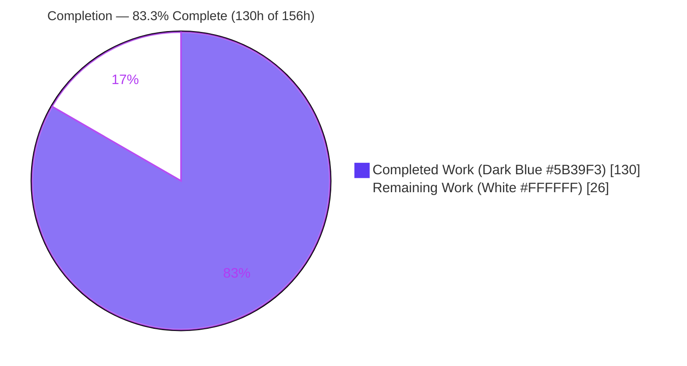
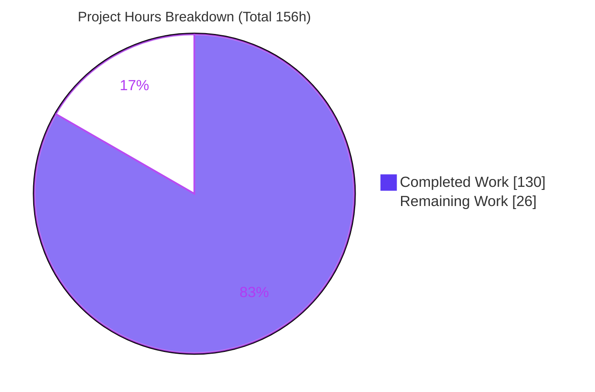
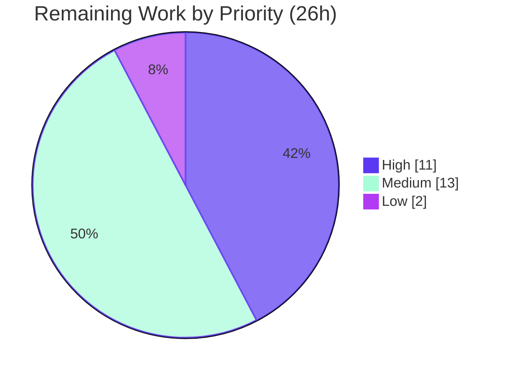

# Blitzy Project Guide — Point-Buy Character Creation Restoration
### Cataclysm: Dark Days Ahead (CDDA)

> Brand legend used throughout this guide — **Completed / AI Work = Dark Blue `#5B39F3`**, **Remaining / Not Completed = White `#FFFFFF`**, Headings/Accents = Violet-Black `#B23AF2`, Highlight = Mint `#A8FDD9`.

---

## 1. Executive Summary

### 1.1 Project Overview

This project restores the **point-buy (point-pool) character-creation system** of Cataclysm: Dark Days Ahead, a single-process C++17 desktop roguelike. The capability — spending a finite point budget across scenario, profession, background, stats, traits, and skills, with a live balance and a guard that blocks finalizing an over-allocated survivor — had been removed in commit `e8b832bd1d` and then orphaned when the creator was rewritten from ncurses to Dear ImGui (`1ae6881bb0`). Because a literal `git revert` is impossible (the ncurses edit sites no longer exist), the feature was **functionally re-implemented into the current ImGui creator**. Target users are CDDA players (who regain the legacy pool modes) and contributors (who receive a fully traceable restoration). Technical scope: one enum, one world option, the ImGui creator, a discovery hint, tests, and a mandated Explainability deliverable.

### 1.2 Completion Status


```mermaid
%%{init: {'theme':'base', 'themeVariables': {'pie1':'#5B39F3','pie2':'#FFFFFF','pieStrokeColor':'#B23AF2','pieStrokeWidth':'2px','pieOuterStrokeWidth':'2px','pieTitleTextSize':'16px','pieSectionTextColor':'#B23AF2'}}}%%
pie showData title Completion — 83.3% Complete (130h of 156h)
    "Completed Work (Dark Blue #5B39F3)" : 130
    "Remaining Work (White #FFFFFF)" : 26
```

| Metric | Hours |
|---|---|
| **Total Hours** | **156** |
| **Completed Hours (AI + Manual)** | **130** (AI/autonomous = 130, Manual = 0) |
| **Remaining Hours** | **26** |
| **Percent Complete** | **83.3%**  *(130 ÷ 156 × 100)* |

**How the percentage is derived (PA1, AAP-scoped):** All 16 AAP feature deliverables and all 5 AAP validation gates are complete and passing (zero rework). The remaining 26 hours are **exclusively human path-to-production** work (review, PR integration, cross-platform verification, QA sign-off, localization). Formula: `Completion % = Completed ÷ (Completed + Remaining) = 130 ÷ (130 + 26) = 130 ÷ 156 = 83.3%`.

### 1.3 Key Accomplishments

- ✅ Restored the `pool_type` enumeration (`ONE_POOL`, `MULTI_POOL`) with **pinned integer values** (`FREEFORM=0, ONE_POOL=1, MULTI_POOL=2, TRANSFER=3`) preserving the on-disk template contract.
- ✅ Re-registered the `CHARACTER_POINT_POOLS` world-default option (`any` / `multi_pool` / `story_teller`, default `story_teller`).
- ✅ Added the `CHARCREATOR_POINTS` tab to the ImGui creator (tab count **7 → 8**, POINTS first) with an option-gated pool-selection surface.
- ✅ Restored the **always-visible points readout** (`pools_to_string`) and **per-selection cost/affordability feedback** across all six builder tabs.
- ✅ Re-instated the **finalize-time over-allocation guard** with pool-specific "Too many points allocated…" prompts and the discard-unspent confirmation.
- ✅ Restored the New Game discovery hint mentioning the "points pool".
- ✅ Delivered the mandated **Explainability artifact** (`doc/POINT_POOL_RESTORATION.md`): decision log + **18-row bidirectional traceability matrix at 100% coverage**.
- ✅ Added a **point-pool regression suite** (5 test cases, 192 assertions) and hardened a security finding (path-traversal in `save_template`).
- ✅ **All five production-readiness gates passed**: build (0 warnings under `-Werror`), tests (1,896 cases / 40,149,483 assertions), UI render (real SDL x11), functional, and backward-compatibility.

### 1.4 Critical Unresolved Issues

| Issue | Impact | Owner | ETA |
|---|---|---|---|
| *None — no release-blocking defects identified* | All 5 AAP gates pass; zero unresolved compilation, test, functional, or security issues at HEAD `d21ed3b144` | — | — |

> No critical unresolved issues exist. All items below in §1.6 and §2.2 are standard human path-to-production steps, not defects.

### 1.5 Access Issues

| System / Resource | Type of Access | Issue Description | Resolution Status | Owner |
|---|---|---|---|---|
| SDL3 (≥ 3.4.0) dev headers | Build dependency | Environment `apt` candidate is SDL3 3.2.20, below the required 3.4.0, so the SDL3 path could not be exercised; build/validation used the supported SDL2 2.32.4 fallback (`SDL3=0`) | Open — SDL2 is a fully supported production backend; SDL3 verification tracked as remaining task M-2 | Human developer |
| Upstream GitHub CI (34 workflows) | CI execution | Upstream CI matrix (MSVC/vcpkg, macOS, clang-tidy, emscripten, IWYU, etc.) runs only on the hosted PR, not in the sandbox | Open — runs automatically on PR open | Maintainer / CI |

> No repository-permission or service-credential access issues were encountered. All in-scope source was committed successfully to branch `blitzy-9435d6be-5219-4010-a3e8-d8ece47ec278`.

### 1.6 Recommended Next Steps

1. **[High]** Perform human code review of the restoration diff (+1,195 lines; focus `src/newcharacter.cpp`), confirming CDDA conventions and no regression to the default FREEFORM flow.
2. **[High]** Open the PR, rebase onto current upstream `master`, and drive the full upstream CI matrix to green.
3. **[Medium]** Verify real-GPU / cross-platform rendering (Windows, macOS, Linux GPU) — validation used headless software rendering.
4. **[Medium]** Conduct an exploratory QA playtest across all pool modes and edge-case templates, and (optionally) verify the SDL3 ≥ 3.4.0 build path.
5. **[Low]** Confirm the 51 new translatable strings are captured by the translation/`.pot` extraction workflow.

---

## 2. Project Hours Breakdown

### 2.1 Completed Work Detail

| Component | Hours | Description |
|---|---|---|
| `pool_type` enum restoration + backward-compat contract | 6 | Re-added `ONE_POOL`/`MULTI_POOL` with pinned integers; `pool_type_from_int()` range-checked normalizer + 64-bit narrowing guard (`src/player_difficulty.h`, `newcharacter.cpp`) |
| `CHARACTER_POINT_POOLS` world-default option | 2 | Re-registered before `META_PROGRESS` with 3 choices, default `story_teller` (`src/options.cpp`) |
| Creator state + `CHARCREATOR_POINTS` tab infrastructure | 6 | Added `pool` field; new enumerator; bumped `CHARACTER_CREATOR_TAB_COUNT` 7→8 and rippled through tab-indexed arrays/dispatch (`src/character_creator_ui.h`) |
| Option read + pool seeding across generation paths | 4 | `avatar::create()` reads the option and seeds `cc_uistate.pool` on every path (CUSTOM/RANDOM/NOW/FULL_RANDOM/TEMPLATE) |
| Pool-selection tab UI | 10 | Option-gated surface: `any` shows all 3 modes; fixed modes show read-only label + template-override annotation |
| Persistent top-bar points readout | 6 | `pools_to_string` colored markup — MULTI_POOL stat/trait/skill breakdown, ONE_POOL total, FREEFORM "Survivor" |
| Per-selection cost/affordability across 6 tabs | 20 | Cost/earn + net-delta + green/red affordability on scenario, profession, background, stats, traits, skills (with `n_gettext` pluralization) |
| Finalize over-allocation guard | 6 | `handle_action` NEXT_TAB@SUMMARY: `point_pool_over_allocated()` + pool-specific popups + discard-unspent confirmation |
| Restored point-math helper set | 8 | `skill_points_left`, `skill_increment_cost`, `point_pool_over_allocated`, `point_pool_has_unspent`, delta markup — all consuming the surviving engine |
| Discovery hint + changelog entry | 1 | Restored "points pool" hint (`src/main_menu.cpp`); user-facing `data/changelog.txt` line |
| Point-pool regression test suite | 16 | `tests/char_creation_points_test.cpp` — 536 lines, 5 cases, 192 assertions (enum, arithmetic, multi-pool borrowing, over-allocation, template round-trip) |
| Explainability deliverable | 8 | `doc/POINT_POOL_RESTORATION.md` — decision log (30+ rows) + 18-row bidirectional traceability matrix (100%) |
| Security hardening (QA F-1) | 3 | Path-traversal fix in `avatar::save_template` via `ensure_valid_file_name()`, protecting all 3 callers |
| Test-suite stabilization | 2 | Flaky `monster_speed_description` fixed via `clear_map()` to keep the full suite deterministic |
| Code review & QA remediation cycles | 12 | Five review rounds (doc review, code review, decision-log correction, QA findings) reflected in commit history |
| Build hardening to zero warnings | 6 | Clean compile under `-Werror -Wall -Wextra -Wpedantic -Wold-style-cast -Wsuggest-override -Wzero-as-null-pointer-constant` |
| Autonomous validation | 14 | Build/test/UI gates, Xvfb x11 real render, 818 screenshots, screen recordings, full in-game playtest |
| **Total Completed** | **130** | *Matches Completed Hours in §1.2* |

### 2.2 Remaining Work Detail

| Category | Hours | Priority |
|---|---|---|
| Human code review of the feature diff (+1,195 lines, esp. `src/newcharacter.cpp`) | 6 | High |
| PR integration: rebase onto upstream `master` + full upstream CI matrix green | 5 | High |
| Real-GPU / cross-platform (Windows, macOS, Linux GPU) render verification | 5 | Medium |
| SDL3 (≥ 3.4.0) build & render forward-compat verification | 4 | Medium |
| Human exploratory QA playtest sign-off (all pool modes + edge templates) | 4 | Medium |
| Localization: route 51 new translatable strings into the `.pot` workflow | 2 | Low |
| **Total Remaining** | **26** | *Matches Remaining Hours in §1.2 and §7* |

### 2.3 Hours Reconciliation

| Check | Value | Status |
|---|---|---|
| §2.1 Completed total | 130h | ✅ |
| §2.2 Remaining total | 26h | ✅ |
| §2.1 + §2.2 | 156h = Total (§1.2) | ✅ |
| §2.2 = §1.2 Remaining = §7 "Remaining Work" | 26h | ✅ |

---

## 3. Test Results

All tests below originate from **Blitzy's autonomous validation logs** for this project (Catch2 via `tests/cata_test`). The point-pool suite was additionally **re-run during this assessment** and passed (192 assertions / 5 cases, exit 0).

| Test Category | Framework | Total Tests | Passed | Failed | Coverage % | Notes |
|---|---|---|---|---|---|---|
| Point-Pool (feature) — unit/logic | Catch2 2.13.10 | 5 cases (192 assertions) | 5 | 0 | 100% of `[points]` scope | `enum_values`, `arithmetic`, `multi_pool_borrowing`, `over_allocation`, `template_limit_round_trip` |
| Full regression suite | Catch2 2.13.10 | 1,896 cases (40,149,483 assertions) | 1,896 | 0 | Full project suite | Ran ~1,123s; zero failures; TESTS never disabled |
| Data integrity (`--jsonverify`) | In-engine loader | 1 run | Pass | 0 | All game JSON incl. new option | Exit 0; `CHARACTER_POINT_POOLS` loads |

**Aggregate:** 1,901 test cases executed across the point-pool and full suites, **0 failures**, ~40.15M assertions. Frameworks: Catch2 (C++). Test types exercised: unit/logic (arithmetic, multi-pool borrowing), boundary (over-allocation), serialization round-trip (template `"limit"`), and data-load verification.

---

## 4. Runtime Validation & UI Verification

Rendered for real under the **SDL x11** path (Xvfb `:99`, 1920×1080×24, software GL) — never the dummy driver — and captured across 818 screenshots and multiple screen recordings.

**Runtime health**
- ✅ **Operational** — `./cataclysm-tiles --version` → `Cataclysm Dark Days Ahead: d21ed3b144 +tiles +sound`.
- ✅ **Operational** — `--jsonverify` exits 0; the new `CHARACTER_POINT_POOLS` option loads with all game data.
- ✅ **Operational** — Main menu renders (color-rich world-gen artwork); New Game hint advertises the points pool (traceability #18).

**UI verification — character creator**
- ✅ **Operational** — Creator shows **8 tabs**: POINTS · SCENARIO · PROFESSION · BACKGROUND · STATS · TRAITS · SKILLS · SUMMARY (POINTS first; traceability #7). *Evidence: `blitzy/screenshots/sv_05_points_tab.png`.*
- ✅ **Operational** — Pool-selection surface gates on the option: `story_teller` → "Survivor (fixed)"; `any` → all three modes (Survivor / Legacy: Multiple pools / Legacy: Single pool).
- ✅ **Operational** — Live points readout: FREEFORM shows "Survivor"; MULTI_POOL shows the stat/trait/skill breakdown; ONE_POOL shows a single total (e.g. "Points left: -2" when over-allocated; traceability #9).
- ✅ **Operational** — Per-selection cost feedback with affordability coloring on the builder tabs (e.g. STATS "Raising this stat costs 1 point"; traceability #11-15).

**Functional / API-equivalent (option ↔ persistence)**
- ✅ **Operational** — Over-allocation guard blocks finalize with "Too many points allocated, change some features and try again." *Evidence: `blitzy/screenshots/tl_08_loaded_onepool_block.png`.*
- ✅ **Operational** — `CHARACTER_POINT_POOLS` serializes end-to-end into `worldoptions.json`.
- ✅ **Operational** — Legacy templates (`limit` 0-3) load to the correct pool; `TRANSFER` transfer-templates load unchanged.

*No ❌ Failing or ⚠ Partial runtime items were observed under the tested (software-rendered) path. Real-GPU / cross-platform confirmation remains a human task (§2.2).*

---

## 5. Compliance & Quality Review

Cross-map of AAP deliverables and mandated rules to their implementation status. The **18-row bidirectional traceability matrix** (AAP §0.5.2) is delivered in full inside `doc/POINT_POOL_RESTORATION.md`.

| # | AAP Deliverable / Rule | Benchmark | Status | Progress |
|---|---|---|---|---|
| 1 | Restore `ONE_POOL`/`MULTI_POOL` enum | Pinned integers preserved | ✅ Pass | 100% |
| 2 | `CHARACTER_POINT_POOLS` world option | 3 choices, default `story_teller` | ✅ Pass | 100% |
| 3 | `CHARCREATOR_POINTS` tab + count 7→8 | Arrays/dispatch consistent | ✅ Pass | 100% |
| 4 | Option read + pool seed in `create()` | All generation paths | ✅ Pass | 100% |
| 5 | Live points readout | `pools_to_string` all modes | ✅ Pass | 100% |
| 6 | Per-selection cost/affordability (6 tabs) | Cost/earn + color | ✅ Pass | 100% |
| 7 | Finalize over-allocation guard | Pool-specific popups | ✅ Pass | 100% |
| 8 | Discovery hint | "points pool" restored | ✅ Pass | 100% |
| 9 | Reuse surviving point-math engine | No parallel math | ✅ Pass | 100% |
| 10 | Backward-compat (template `"limit"`) | Round-trip test green | ✅ Pass | 100% |
| 11 | Point-pool regression tests | 5 cases / 192 assertions | ✅ Pass | 100% |
| 12 | Explainability: decision log | Rationale out of code comments | ✅ Pass | 100% |
| 13 | Explainability: traceability matrix | 18 rows, 100% coverage | ✅ Pass | 100% |
| 14 | Build gate (`TILES=1`, tests on) | 0 warnings under `-Werror` | ✅ Pass | 100% |
| 15 | Tests gate | "All tests passed", exit 0 | ✅ Pass | 100% |
| 16 | UI gate | Renders under SDL x11 | ✅ Pass | 100% |
| 17 | Security: path-traversal (QA F-1) | Sanitized template path | ✅ Pass (fixed) | 100% |
| 18 | Style: astyle / zero placeholders | astyle "Unchanged"; no TODO/stub | ✅ Pass | 100% |

**Fixes applied during autonomous validation:** path-traversal hardening in `avatar::save_template` (QA F-1); flaky `monster_speed_description` stabilized via `clear_map()`; code-review and decision-log corrections. **Outstanding compliance items:** none — clang-tidy/IWYU/cross-platform lints run in upstream CI (§6, §2.2).

---

## 6. Risk Assessment

| Risk | Category | Severity | Probability | Mitigation | Status |
|---|---|---|---|---|---|
| Large single-file change (`newcharacter.cpp` +514/-16) raises review & conflict burden | Technical | Medium | Medium | 5 regression tests, 100% traceability matrix, zero-warning build | Mitigated |
| emscripten / WASM build path not exercised locally | Technical | Low | Low | Covered by upstream emscripten CI target | Open (CI-gated) |
| clang-tidy / IWYU may flag include/style nits beyond local g++ | Technical | Low | Medium | `.clang-tidy` present; astyle dry-run clean | Open (CI-gated) |
| Path traversal via template name in `save_template` | Security | High | Medium (pre-fix) | Fixed with `ensure_valid_file_name()`; protects all 3 callers | **Resolved** |
| Untrusted template `"limit"` integer deserialization | Security | Medium | Low | Range-checked `pool_type_from_int` + 64-bit narrowing → FREEFORM | Mitigated |
| Built/validated on SDL2 fallback only (SDL3 ≥ 3.4.0 unavailable) | Operational | Medium | Low | SDL2 is a supported production backend; SDL3 tracked as M-2 | Open (task) |
| UI validated under headless software rendering, not real GPU / Win / macOS | Operational | Medium | Low | ImGui is renderer-agnostic; layout logic identical | Open (task) |
| 51 new translatable strings must enter `.pot` workflow | Operational | Low | Medium | Route through translation extraction (task L-1) | Open (task) |
| Merge onto fast-moving upstream `master` (`newcharacter.cpp` actively developed) | Integration | Medium | Medium | Rebase early + upstream CI | Open (task) |
| Backward-compat of existing character / transfer templates | Integration | High (if broken) | Very Low | Pinned integers + round-trip test | Mitigated |
| `CHARACTER_POINT_POOLS` persistence to `worldoptions.json` | Integration | Low | Low | Verified end-to-end in validation | Mitigated |

**Overall risk posture: LOW.** The one High-severity security risk was resolved; all other High-impact items are mitigated by tests and preserved contracts. Remaining open items are environmental/process, not code defects.

---

## 7. Visual Project Status


```mermaid
%%{init: {'theme':'base', 'themeVariables': {'pie1':'#5B39F3','pie2':'#FFFFFF','pieStrokeColor':'#B23AF2','pieStrokeWidth':'2px','pieOuterStrokeWidth':'2px','pieTitleTextSize':'16px','pieSectionTextColor':'#B23AF2'}}}%%
pie showData title Project Hours Breakdown (Total 156h)
    "Completed Work" : 130
    "Remaining Work" : 26
```

**Remaining hours by category (§2.2) — priority distribution:**


```mermaid
%%{init: {'theme':'base', 'themeVariables': {'pie1':'#5B39F3','pie2':'#A8FDD9','pie3':'#B23AF2','pieStrokeColor':'#5B39F3','pieOuterStrokeWidth':'2px'}}}%%
pie showData title Remaining Work by Priority (26h)
    "High" : 11
    "Medium" : 13
    "Low" : 2
```

> Integrity: pie "Completed Work" = 130 (= §1.2 Completed, = §2.1 total); pie "Remaining Work" = 26 (= §1.2 Remaining, = §2.2 total). Priority split 11 + 13 + 2 = 26. Completed = Dark Blue `#5B39F3`; Remaining = White `#FFFFFF`.

---

## 8. Summary & Recommendations

**Achievements.** The point-buy character-creation system is **fully restored** into the current Dear ImGui creator. Every one of the 16 AAP feature deliverables and all 5 AAP validation gates are complete and passing: the enum and world option are back with a preserved on-disk contract; the `CHARCREATOR_POINTS` tab, live points readout, and per-tab cost/affordability feedback are wired into the ImGui UI; the finalize over-allocation guard blocks invalid ONE_POOL/MULTI_POOL characters while FREEFORM stays unconstrained; and the mandated Explainability artifact ships with a 100%-coverage 18-row traceability matrix. The build is clean under the strictest `-Werror` flags and the full Catch2 suite passes (1,896 cases / 40.1M assertions, 0 failures).

**Remaining gaps.** The outstanding 26 hours are entirely **human path-to-production**, not defects: code review, PR integration with upstream CI, cross-platform / real-GPU render verification, an SDL3 ≥ 3.4.0 forward-compat check, an exploratory QA sign-off, and routing new strings through localization.

**Critical path to production.** (1) Human code review → (2) PR + upstream CI green → (3) cross-platform render + QA sign-off → merge. SDL3 and localization can proceed in parallel and are non-blocking.

| Success Metric | Target | Actual |
|---|---|---|
| AAP feature deliverables complete | 16/16 | ✅ 16/16 |
| AAP validation gates passed | 5/5 | ✅ 5/5 |
| Traceability coverage | 100% (18 rows) | ✅ 100% |
| Full test suite | 0 failures | ✅ 0 / 1,896 |
| Build warnings under `-Werror` | 0 | ✅ 0 |
| Release-blocking defects | 0 | ✅ 0 |

**Production-readiness assessment.** The autonomous deliverable is **production-ready pending standard human review and cross-platform confirmation**. AAP-scoped completion is **83.3%** (130h of 156h); the remaining 16.7% is human-in-the-loop deployment work. Recommendation: **proceed to code review and PR** with high confidence.

---

## 9. Development Guide

> All commands below were **tested** in the validation environment (Ubuntu 25.10, g++ 15.2.0, SDL2 2.32.4). Run from the repository root.

### 9.1 System Prerequisites

- **OS:** Linux (Ubuntu 25.10 verified); Windows/macOS supported via upstream toolchains.
- **Compiler:** `g++` 15.2.0 (C++17). Clang also supported upstream.
- **Build tools:** GNU Make 4.4.1; `ccache` 4.11.2 (optional, recommended).
- **Hardware:** ~4 GB RAM; the build produces large binaries (`cataclysm-tiles` ≈ 287 MB, `tests/cata_test` ≈ 373 MB).

### 9.2 Environment Setup & Dependencies (SDL2 tiles stack)

Verify the runtime/build libraries are present (all confirmed via `pkg-config`):

```bash
for p in sdl2 SDL2_ttf SDL2_image SDL2_mixer freetype2 zlib bzip2; do
  printf '%-12s ' "$p"; pkg-config --modversion "$p"
done
# Expected: sdl2 2.32.4 · SDL2_ttf 2.24.0 · SDL2_image 2.8.8 · SDL2_mixer 2.8.1 · freetype2 26.2.20 · zlib 1.3.1 · bzip2 1.0.8
```

> Note: SDL3 ≥ 3.4.0 is *not* required for this build. The verified path uses the SDL2 backend with `SDL3=0`.

### 9.3 Build (tiles, tests enabled)

```bash
export CCACHE_DIR=/tmp/ccache
ccache -M 5G
make -j2 RELEASE=1 TILES=1 SOUND=1 SDL3=0 ASTYLE=0 LINTJSON=0 CCACHE=1
```

- Compiles under `-Werror -Wall -Wextra -Wpedantic -Wold-style-cast -Wsuggest-override -Wzero-as-null-pointer-constant` with **zero warnings**.
- **Never** set `TESTS=0` — the test binary must build.
- Produces `./cataclysm-tiles` and `./tests/cata_test`.

### 9.4 Verify the Build

```bash
./cataclysm-tiles --version
# → Cataclysm Dark Days Ahead: d21ed3b144  +tiles, +sound

SDL_VIDEODRIVER=dummy SDL_AUDIODRIVER=dummy ./cataclysm-tiles --jsonverify   # exit 0 = all data (incl. CHARACTER_POINT_POOLS) loads
```

### 9.5 Run the Tests

```bash
# Point-pool feature suite (fast) — tested this session: "All tests passed (192 assertions in 5 test cases)"
SDL_VIDEODRIVER=dummy SDL_AUDIODRIVER=dummy ./tests/cata_test "[points]" --user-dir=test_user_dir

# List the point-pool cases
./tests/cata_test --list-tests "[points]"

# Full regression suite (~1,123s): "All tests passed (40,149,483 assertions in 1896 test cases)"
SDL_VIDEODRIVER=dummy SDL_AUDIODRIVER=dummy ./tests/cata_test --user-dir=test_user_dir
```

### 9.6 Run the UI Headlessly (verify the creator renders)

```bash
Xvfb :99 -screen 0 1920x1080x24 &
DISPLAY=:99 SDL_VIDEODRIVER=x11 SDL_AUDIODRIVER=dummy LIBGL_ALWAYS_SOFTWARE=1 \
  XDG_RUNTIME_DIR=/tmp/xdg ./cataclysm-tiles --userdir <seeded-userdir>
# Config seed: FULLSCREEN=no, RENDERER=software, TERMINAL_X=240, TERMINAL_Y=67, USE_LANG=en
```

### 9.7 Example Usage (exercise the feature)

1. **New game → Create World →** World options → set **`CHARACTER_POINT_POOLS = any`** → Finish.
2. **New game → Custom Character.** The **POINTS** tab is first; it lists *Survivor*, *Legacy: Multiple pools*, *Legacy: Single pool*.
3. Select **Legacy: Single pool**. The top bar shows **"Points left: N"**. Overspend on STATS/SKILLS until it goes negative.
4. Go to **SUMMARY → Finish.** The finalize guard blocks with **"Too many points allocated, change some features and try again."**
5. Reduce allocations until *Points left ≥ 0*, then finalize successfully.

### 9.8 Troubleshooting

- **`error: externally-managed-environment` (pip):** not needed for this C++ build; if required, use a `venv` or `--break-system-packages`.
- **Blank window when headless:** ensure `SDL_VIDEODRIVER=x11`, `Xvfb` is running, and `LIBGL_ALWAYS_SOFTWARE=1`; a WM-less Xvfb needs a keyboard-focus helper for input.
- **`patch does not apply` when attempting a git revert of the removal:** expected — this restoration is *functional into ImGui*, not a revert.
- **SDL3 compile errors:** use `SDL3=0` unless SDL3 ≥ 3.4.0 dev headers are installed.
- **Slow rebuilds:** enable `CCACHE=1` with `CCACHE_DIR` set.

---

## 10. Appendices

### A. Command Reference

| Purpose | Command |
|---|---|
| Build (tiles, SDL2) | `make -j2 RELEASE=1 TILES=1 SOUND=1 SDL3=0 ASTYLE=0 LINTJSON=0 CCACHE=1` |
| Version | `./cataclysm-tiles --version` |
| Data verify | `SDL_VIDEODRIVER=dummy ./cataclysm-tiles --jsonverify` |
| Point-pool tests | `SDL_VIDEODRIVER=dummy SDL_AUDIODRIVER=dummy ./tests/cata_test "[points]" --user-dir=test_user_dir` |
| Full test suite | `SDL_VIDEODRIVER=dummy SDL_AUDIODRIVER=dummy ./tests/cata_test --user-dir=test_user_dir` |
| List point tests | `./tests/cata_test --list-tests "[points]"` |
| Feature diff | `git diff b65952abda^..HEAD --stat` |
| Style check (dry-run) | `astyle --dry-run --options=.astylerc src/newcharacter.cpp` |

### B. Port Reference

*Not applicable — CDDA is a single-process desktop game and opens no network ports. The only display "endpoint" is the X server (`DISPLAY=:99` in the headless setup).*

### C. Key File Locations

| File | Role | Change |
|---|---|---|
| `src/player_difficulty.h` | `pool_type` enum + `pool_type_from_int` decl | +25 / -1 |
| `src/options.cpp` | `CHARACTER_POINT_POOLS` registration | +8 |
| `src/character_creator_ui.h` | Creator state `pool` + `CHARCREATOR_POINTS` + count 7→8 | +7 / -2 |
| `src/newcharacter.cpp` | Creator logic, helpers, finalize guard, per-tab cost | +514 / -16 |
| `src/main_menu.cpp` | New Game "points pool" hint | +1 / -1 |
| `data/changelog.txt` | User-facing changelog entry | +1 |
| `doc/POINT_POOL_RESTORATION.md` | Explainability: decision log + traceability matrix | +121 (new) |
| `tests/char_creation_points_test.cpp` | Point-pool regression suite | +536 (new) |
| `tests/speed_description_test.cpp` | Flaky-test stabilization | +2 |

### D. Technology Versions

| Component | Version |
|---|---|
| Language | C++17 |
| Compiler | g++ 15.2.0 |
| Build | GNU Make 4.4.1, ccache 4.11.2 |
| UI framework | Dear ImGui 1.92.8 |
| Test framework | Catch2 2.13.10 |
| Rendering | SDL2 2.32.4 (+ SDL2_ttf 2.24.0, SDL2_image 2.8.8, SDL2_mixer 2.8.1); SDL3 ≥ 3.4.0 supported but not used here |
| Support libs | freetype2 26.2.20, zlib 1.3.1, bzip2 1.0.8 |
| Build target | `cataclysm-tiles` (≈287 MB), `tests/cata_test` (≈373 MB) |
| HEAD commit | `d21ed3b144` |

### E. Environment Variable Reference

| Variable | Purpose | Example |
|---|---|---|
| `CCACHE_DIR` | ccache cache location | `/tmp/ccache` |
| `SDL_VIDEODRIVER` | SDL video backend | `x11` (real render) / `dummy` (headless tests) |
| `SDL_AUDIODRIVER` | SDL audio backend | `dummy` |
| `LIBGL_ALWAYS_SOFTWARE` | Force software GL under Xvfb | `1` |
| `DISPLAY` | X server for headless render | `:99` |
| `XDG_RUNTIME_DIR` | Runtime dir for the session | `/tmp/xdg` |

*In-game option (not an env var): `CHARACTER_POINT_POOLS` (world default) — `any` / `multi_pool` / `story_teller`.*

### F. Developer Tools Guide

| Tool | Use |
|---|---|
| `Xvfb` | Headless X server for real SDL x11 rendering |
| `ffmpeg` / `ffprobe` | Capture/inspect UI screen recordings |
| `xdotool`, `xwininfo` | Window focus / geometry inspection under Xvfb |
| `imagemagick` (`convert`) | Crop/annotate verification screenshots |
| `astyle` | CDDA C++ formatting (config: `.astylerc`) |
| `clang-tidy` | Static analysis (config: `.clang-tidy`) — runs in upstream CI |
| Verification artifacts | `blitzy/screenshots/` (818 PNGs), `blitzy/screen_recordings/` (recordings + survivor dossier/journal) |

### G. Glossary

| Term | Definition |
|---|---|
| **Point buy / point pool** | Character-creation mode with a finite point budget spent across scenario/profession/background/stats/traits/skills |
| **FREEFORM** | "Survivor" mode — no point limit (the current default) |
| **ONE_POOL** | "Legacy: Single pool" — one shared point budget |
| **MULTI_POOL** | "Legacy: Multiple pools" — separate stat/trait/skill pools with cross-pool borrowing |
| **TRANSFER** | Character-transfer template mode (`limit == 3`); no edits allowed |
| **`pool_type`** | Enum serialized as the integer `"limit"` in character templates (contract: 0/1/2/3) |
| **`CHARACTER_POINT_POOLS`** | World-default option gating which pool modes the creator offers |
| **`CHARCREATOR_POINTS`** | The restored pool-selection tab (creator tab count 7→8) |
| **Explainability artifact** | User-mandated decision log + bidirectional traceability matrix (`doc/POINT_POOL_RESTORATION.md`) |
| **Traceability matrix** | 18-row removed⇄restored mapping at 100% coverage |